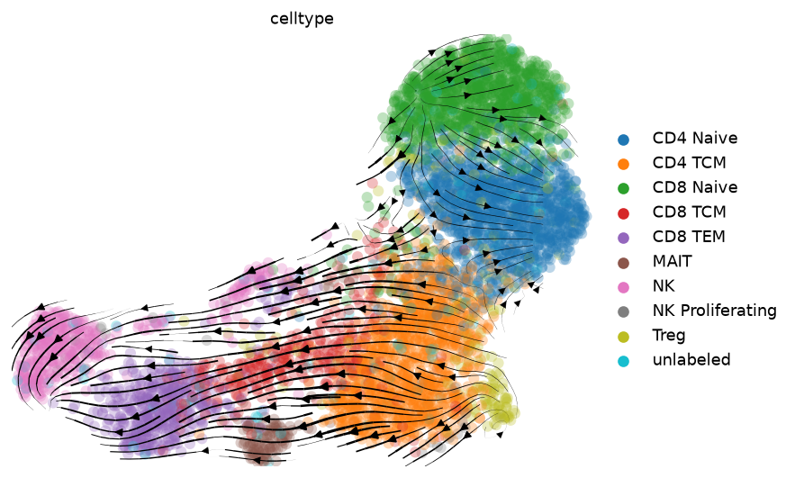
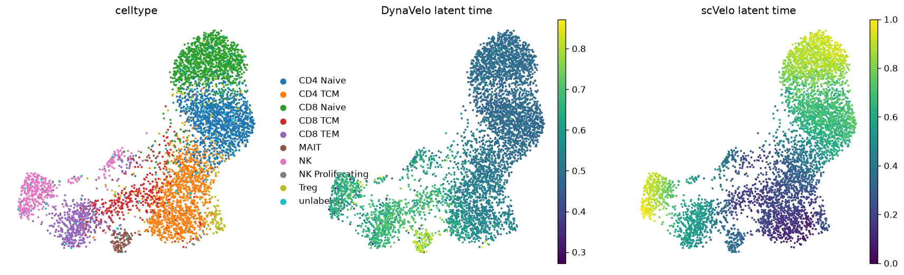
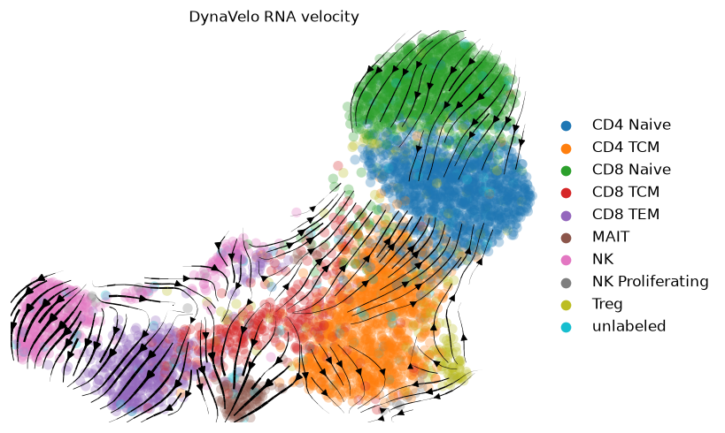

# DynaVelo の実行結果 — PBMC マルチオームで学習し、context A 対応細胞で in-silico ノックダウン

2026-10-05 実施。[DynaVelo](https://github.com/karbalayghareh/DynaVelo)（commit `c82ed77`）を
context A に近い初代 T 細胞のマルチオームデータで学習し、VCC の予測に使えるかを測った。

* **ビューワー**: [`docs/dynavelo/viewer.html`](dynavelo/viewer.html)
  （単一ファイル・データ埋め込み済み。ダウンロードしてブラウザで開く。GitHub 上ではソース表示になる）
* **スクリプト**: [`dynavelo/`](../dynavelo/)
* **表**: [`docs/dynavelo/contextA_perturbation_summary.csv`](dynavelo/contextA_perturbation_summary.csv)、
  [`docs/dynavelo/tf_perturbation_by_celltype.csv`](dynavelo/tf_perturbation_by_celltype.csv)

---

## 0. 最初に読むべき 3 行

1. **学習は正常に動いた。** scVelo 速度とのコサイン類似度 0.73、潜在時間はナイーブ → TCM →
   エフェクター/MAIT の順で、scVelo 単体より生物学的に自然な向きになった。
2. **in-silico ノックダウンは、そのままでは VCC の予測にならない。** 発現変化は最大でも
   0.0185（log1p）、上位 1,000 摂動の分散の 84% が 1 本の軸に乗る。
   どの遺伝子を落としても「ナイーブ遺伝子が下がりエフェクター遺伝子が上がる」同じプロファイルになる。
3. **補助特徴量としても効かなかった。** v25 の遺伝子類似度に足すと、H1 代理スコアは
   4 シードすべてで悪化した（平均 −0.0072）。**提出はしていない**（§7）。

---

## 1. 入力データ

`vcc_data.zip` の中身:

| ファイル | 内容 |
|---|---|
| `cluster0_and_3_rna.h5ad` | 5,279 細胞 × 36,601 遺伝子、生カウント。10x PBMC マルチオームの Leiden cluster 0（4,287）と 3（992） |
| `cluster0_and_3_atac.h5ad` | 同じ 5,279 細胞 × 111,857 ピーク、生カウント |
| `cluster0_and_3_velocyto.loom` | 同じ細胞の spliced / unspliced / ambiguous |
| `context_A_to_cluster0_3_umap2d_nearest_barcodes.csv` | context A の対照 18,400 細胞それぞれについて、2 次元 UMAP 上で最も近い PBMC 細胞 |

細胞種の内訳（元データの注釈）: CD4 Naive 1,257 / CD8 Naive 1,178 / CD4 TCM 1,134 / CD8 TEM 463 /
NK 411 / CD8 TCM 335 / unlabeled 185 / Treg 177 / MAIT 113 / NK Proliferating 25 / HSPC 1。

**context A の対応先は偏っている。** 18,400 細胞が **469 個**の PBMC 細胞に集中し、全部 cluster 0。
割り当て先は CD4 Naive 13,894（76%）、CD4 TCM 3,240、unlabeled 828、Treg 345、CD8 Naive 83、CD8 TCM 10。
UMAP 距離の中央値は 0.044。

---

## 2. やったこと

### 2.1 配布チェックポイントは使えない

DynaVelo のリポジトリにあるチェックポイントは**マウス**の胚中心 B 細胞など（入力 2,623 遺伝子 ×
169 TF）で、遺伝子セットが違う。ヒト PBMC への「推論」はできないので、**このデータで新規学習した。**

### 2.2 RNA 前処理と scVelo（`dynavelo/01_prep_rna.py`）

DynaVelo の `preprocessing/joint_rna_motif_analysis.ipynb` に合わせた。

1. 10 細胞未満の細胞種（HSPC 1 細胞）を除外。DynaVelo の細胞重みが 1/頻度なので 1 細胞の種は重みが壊れる。
2. `min_counts=1000` で細胞を絞る → **5,225 細胞**。MALAT1 を除く。
3. `scv.pp.filter_and_normalize(min_shared_counts=10)` → 6,045 遺伝子が残る。log1p。
4. モデルに入れる遺伝子 = HVG 2,000 ∪ JASPAR モチーフを持つ TF（発現細胞 2% 超）170 ∪ 平均発現上位 2,000
   → **3,381 遺伝子**。`data/vcc_target_genes.txt` を置けばその遺伝子も加える。
5. PCA 30・近傍 30 → `moments` → `recover_dynamics` → `velocity(mode='dynamical')` → `latent_time`。

**速度が推定できたのは 3,381 遺伝子中 392 個だけ**（うち velocity genes 317）。
残りは NaN で、DynaVelo 側でマスクされる。速度の教師信号は薄い。

scVelo の流線は TCM → ナイーブ方向を向き、潜在時間もナイーブが後期になる。
静止期 PBMC の RNA 速度が信頼できないのは既知の問題で、ここでも再現している。



### 2.3 ATAC 前処理と chromVAR（`dynavelo/02_prep_atac_chromvar.py`）

1. 常染色体と chrX のうち 3% 以上の細胞で開いているピーク → **36,627 ピーク**。
2. `pychromvar`（hg38、背景ピーク 50 回、モチーフ p=5e-5）で JASPAR2024 CORE vertebrates の
   単量体モチーフ 182 個の偏差 z-score を計算。TF あたり分散最大の 1 個に絞り **171 TF**。
3. 著者は ArchR の補完済みモチーフ行列を使っているので、ATAC の LSI 空間（第 1 成分は深度と
   相関 0.99 なので除外）の 30 近傍で z-score を平滑化した。

z-score の分散が大きい TF: JUN / FOSL2 / BATF / FOS（AP-1）、BACH1 / BACH2、NFE2L2、ZEB1、TBX21、RUNX1。
BNC2 と BATF、TCF12 と TCF3 は 7 塩基の認識配列がほぼ同じでマッチが完全に一致する（別々の TF として残した）。

### 2.4 学習（`dynavelo/03_train_dynavelo.py`）

デモノートブックと同じ既定値（潜在 50+50、隠れ 200、lr 1e-3、バッチ 128、テスト 10%、
`max_epoch=200`、early stopping 10）。Tesla T4 で **143 エポック・53 分**。

| | 最終値（テスト） |
|---|---|
| 総損失 | 12,728（1 エポック目 38,804） |
| RNA 再構成の NLL | 17,646 |
| モチーフ再構成の NLL | 1,059 |
| 速度コサイン | 0.707（1 エポック目 0.505） |

### 2.5 上流コードからの変更点

リポジトリは無改変。互換性の問題は `dynavelo/dv_common.py` 側で吸収した。

| 変更 | 理由 |
|---|---|
| `odeint_adjoint` → `odeint`（直接逆伝播） | 同じ 10 バッチで損失が 6 桁一致、時間は 26 秒 → 5 秒。状態は 100 次元なのでメモリも問題ない |
| `ReduceLROnPlateau` の `verbose` 引数を無視 | torch 2.7 以降で削除された |
| `MultiomeDataset.__getitem__` を位置参照に | pandas の `Series[int]` がラベル参照になった |

環境: torch 2.14.1 / scvelo 0.3.4 / scanpy 1.11.5 / torchdiffeq 0.2.5 / anndata 0.12.19 / Python 3.11。

### 2.6 予測（`evaluation-sample`、20 サンプル）

| 指標 | 値 |
|---|---|
| 速度コサイン（scVelo vs DynaVelo、速度のある 392 遺伝子、全細胞平均） | **0.734**（中央値 0.753） |
| RNA 再構成（全要素の Pearson） | 0.560 |
| RNA 再構成（遺伝子平均どうしの Pearson） | 0.996 |
| モチーフ再構成（全要素の Pearson） | 0.726（TF ごとの中央値 0.436） |
| 潜在時間の Spearman（DynaVelo vs scVelo） | **−0.456** |
| 速度の不確かさ（遺伝子ごとの std / \|mean\| の中央値） | 1.26 |

細胞種ごと:

| 細胞種 | 細胞数 | DynaVelo 潜在時間 | scVelo 潜在時間 | 速度コサイン | context A 割り当て |
|---|---|---|---|---|---|
| unlabeled | 132 | 0.467 | 0.545 | 0.714 | 771 |
| CD4 Naive | 1,257 | 0.475 | 0.634 | 0.644 | 13,894 |
| CD8 Naive | 1,178 | 0.481 | 0.820 | 0.700 | 83 |
| Treg | 177 | 0.504 | 0.365 | 0.656 | 345 |
| CD4 TCM | 1,134 | 0.532 | 0.224 | 0.765 | 3,240 |
| NK | 411 | 0.619 | 0.764 | 0.813 | 0 |
| CD8 TCM | 335 | 0.620 | 0.247 | 0.822 | 10 |
| CD8 TEM | 463 | 0.649 | 0.509 | 0.854 | 0 |
| NK Proliferating | 25 | 0.656 | 0.374 | 0.843 | 0 |
| MAIT | 113 | 0.754 | 0.327 | 0.855 | 0 |

**DynaVelo の潜在時間はナイーブ → TCM → エフェクター/MAIT に並ぶ。** scVelo は逆で、
両者は負に相関する。速度の向きを scVelo から教わりながら、時間の順序は ATAC 側（AP-1・TBX21・
RUNX のモチーフ活性）に引かれて反転した形。潜在時間の範囲は 0.27〜0.87 で、事前分布 Beta(2,2)
の中央に寄っている。

**context A が乗るナイーブ側は、速度の一致が最も悪い**（CD4 Naive 0.644、Treg 0.656）。




モチーフ速度の絶対値が大きい TF: JUN、BATF、BNC2、FOSL2、FOS、BACH1、BACH2、TBX21、MGA、NFE2L2、
RUNX1、ZEB1、TCF7L2、TCF4、RORA。AP-1 系はどの細胞種でも上昇中、TCF 系は低下中と出る。

---

## 3. in-silico ノックダウン（`dynavelo/04_perturb_contextA.py`）

規則は上流の `predict_perturbation` と同じ: 遺伝子の発現を全細胞中の最小値（log1p なので 0）に置き、
モチーフを持つ TF ならモチーフ z-score も最小値に置いて、`evaluation-fixed` で順伝播する。

上流の関数は `[細胞 × 遺伝子 × 摂動]` の配列を確保するので全遺伝子では 43 GB になる。
同じ計算を逐次集計に書き直した。

* **Part A**: 全 3,381 遺伝子 × context A 対応細胞。QC 後に残った **466 細胞**（context A の
  18,343 細胞分）を、割り当てられた context A 細胞数で重み付け平均。54.5 分。
* **Part B**: 171 TF × 全 5,225 細胞 → 細胞種別の要約。31.3 分。

出力 `contextA_dynavelo_perturbation.h5ad`（3,381 摂動 × 3,381 遺伝子、gitignore のため未コミット）:
`X` = デコードされた log1p 発現の変化、`layers['delta_velocity']` = RNA 速度の変化、
`obsm` = モチーフ活性・モチーフ速度の変化。

### 3.1 効果が小さい

| | 値 |
|---|---|
| 発現変化の絶対値の最大（全摂動 × 全遺伝子） | **0.0185** |
| 他遺伝子への効果ノルムの中央値 | 0.0025 |
| 効果ノルムが 0.01 を超える摂動 | 225 / 3,381 |
| 潜在時間の変化（TF × 細胞種、最大） | 0.033 |
| TF ノックダウン後の速度と元の速度のコサイン（最小） | 0.9989 |

ベースラインの平均 log1p 発現は 0.225。CRISPRi の実測応答とは桁が違う。

### 3.2 ほぼ 1 方向

効果の大きい 1,000 摂動の特異値分解:

| 成分 | 1 | 2 | 3 | 4 | 5 |
|---|---|---|---|---|---|
| 分散の割合 | **0.843** | 0.081 | 0.054 | 0.010 | 0.003 |

摂動プロファイルどうしの |コサイン| の平均は 0.693。

第 1 成分の中身:

* **下がる**: LEF1、MAML2、BACH2、FOXP1、SERINC5、PDE3B、PRKCA、CAMK4、FHIT、INPP4B、BCL11B、CCR7、TCF7
* **上がる**: PLCB1、AOAH、CCL5、MYO1F、RAP1GAP2、A2M、PFN1、S100A4、ACTG1、SAMD3

ナイーブ T 細胞プログラムの低下とエフェクター/細胞骨格遺伝子の上昇。モデルが学習したのは
この分化軸で、摂動はその上を少し動かすだけ。

効果の大きい上位 10 摂動:

| 摂動 | TF | 発現細胞の割合 | 自身の変化 | 他遺伝子への効果ノルム |
|---|---|---|---|---|
| LEF1 | ○ | 0.951 | −0.0185 | 0.0925 |
| BCL2 | | 0.967 | −0.0078 | 0.0871 |
| CAMK4 | | 0.902 | −0.0104 | 0.0774 |
| BACH2 | ○ | 0.903 | −0.0119 | 0.0765 |
| FHIT | | 0.849 | −0.0090 | 0.0750 |
| DOCK10 | | 0.960 | −0.0040 | 0.0564 |
| PRKCA | | 0.932 | −0.0058 | 0.0495 |
| MAML2 | | 0.939 | −0.0076 | 0.0467 |
| FOXP1 | ○ | 0.980 | −0.0060 | 0.0417 |
| TSHZ2 | | 0.707 | −0.0021 | 0.0412 |

上位はナイーブ T 細胞で高発現の遺伝子で、ノックダウンすると全部同じプロファイル
（LEF1・MAML2・BACH2・FOXP1 が下がる）になる。

### 3.3 効果の大きさは発現量で決まる

効果ノルムと摂動遺伝子の平均発現の相関は **0.66**。発現が高い遺伝子ほど 0 に置いたときの
入力の変化が大きく、その分だけ潜在空間で動く。制御関係というより入力の変位量を見ている。
モチーフ TF の効果ノルム中央値は 0.0058、それ以外は 0.0024 で、TF はモチーフ入力も動かす分だけ大きい。

### 3.4 標的自身の低下も再現されない

ノックダウンした遺伝子自身のデコード発現が下がったのは **62%**、平均変化は −0.0001。
入力を 0 にしても、エンコーダ → ODE → デコーダを通ると元の値に戻る。
VCC では標的自身の低下が確実に測られるので、ここは別に上書きする必要がある
（本リポジトリの on-target モデルが既にやっている）。

### 3.5 TF ノックダウンと潜在時間

潜在時間の変化が大きい TF（細胞種別の最大絶対値）: BCL11B 0.033、JUN 0.027、ZEB1 0.026、FOS 0.025、
BNC2 0.025、RUNX1 0.023、TBX21 0.021、RORA 0.020、BACH2 0.020、FOSL2 0.018。

BCL11B・JUN・FOS・RUNX1・TBX21 を落とすと潜在時間が**早まり**（未分化側へ）、ZEB1 は**進む**。
向きは生物学的に筋が通るが、大きさは潜在時間の全幅 0.6 に対して 5% 程度。

---

## 4. なぜこうなるか

* **学習データに摂動が無い。** DynaVelo は定常状態の細胞集団から速度場を学ぶモデルで、
  入力を動かしたときの応答は、データ多様体に沿った補間で決まる。多様体の主軸が 1 本
  （ナイーブ ↔ エフェクター）なら、応答もその 1 本になる。
* **変分エンコーダが入力の 1 遺伝子の変化を吸収する。** 3,381 次元 → 50 次元の線形 + GELU で、
  1 遺伝子の寄与は小さい。KL 係数 1,000 も潜在表現を事前分布に寄せる。
* **速度の教師が 392 遺伝子しか無い。** 残りの遺伝子の速度は再構成とデコーダのヤコビアンから決まる。
* 著者の用途は「どの TF が軌道を動かすか」の順位付けで、発現プロファイルの定量予測ではない。

---

## 5. VCC にどう使えるか

| 使い方 | 見込み |
|---|---|
| 単独で提出 | **使えない。** `pds`（摂動の識別）がほぼ取れない。効果量も足りず DE 系指標の yield が出ない |
| 遺伝子類似度の特徴ブロック（`--features` に並べる） | **測って却下**（§7）。H1 代理スコアで 4 シードとも負、K562 実測署名との相関も無い |
| context A の細胞状態の記述 | 潜在時間・潜在表現（`zx_mean` / `zy_mean`）は context A 対応細胞の状態を 100 次元で表す。細胞株の類似度づけに使える可能性 |
| TF モチーフ活性そのもの（chromVAR z-score） | DynaVelo を通さなくても得られる。context A で開いているモチーフの情報として独立に使える |

**カバー率の制約**: 最初のモデルの 3,381 遺伝子に入る本番標的は 85 / 300。標的を保護して
再学習すれば 300 すべて入るが、PBMC で 2% 超の細胞に発現する標的は 253、10% 超は 116 しかない。

---

## 6. 再現手順

スクリプトのパスは `/home/azureuser/vcc` 固定（`ROOT` を書き換える）。

```bash
# 環境
uv venv --python 3.11 .venv
uv pip install -p .venv/bin/python torch torchdiffeq torchmetrics scanpy anndata scvelo loompy \
    pandas h5py scikit-learn matplotlib pychromvar pyjaspar pysam biopython
git clone https://github.com/karbalayghareh/DynaVelo
curl -L -o ref/hg38.fa.gz https://hgdownload.soe.ucsc.edu/goldenPath/hg38/bigZips/hg38.fa.gz && gunzip ref/hg38.fa.gz

# 実行（合計約 2.5 時間、T4）
.venv/bin/python dynavelo/01_prep_rna.py            # 2 分
.venv/bin/python dynavelo/02_prep_atac_chromvar.py  # 4 分
.venv/bin/python dynavelo/03_train_dynavelo.py 200  # 学習 53 分 + 予測 7 分
.venv/bin/python dynavelo/04_perturb_contextA.py    # 86 分
.venv/bin/python dynavelo/05_qc.py
.venv/bin/python dynavelo/06_build_viewer.py dynavelo/viewer_template.html docs/dynavelo/viewer.html
```

`dv_common.py` は `DynaVelo/dynavelo` に `chdir` するので、チェックポイントとログは
クローンした DynaVelo の `checkpoints/PBMC/cluster0_3/` と `log/` に出る。

---

## 7. 提出の判定 — DynaVelo 特徴は v25 を悪化させたので提出しなかった

方針は「v25 構成に DynaVelo を遺伝子類似度の特徴として足し、H1 代理スコアで v25 を上回れば提出」。
**4 シードすべてで v25 を下回った。提出枠は使っていない。**

### 7.1 再学習と特徴量

最初のモデル（§2〜§3）は本番 300 標的のうち **85 個**しか遺伝子セットに含んでいなかった。
300 標的と 2025 検証分割の 46 標的を遺伝子フィルタから保護して再学習した
（3,625 遺伝子 × 189 TF、84 エポック・35 分、テストの速度コサイン 0.64）。346 標的すべてが入った。

特徴量は「最小値に置く」ノックダウンではなく**単位摂動応答**にした（`dynavelo/07_gene_features.py`）。
§3.3 のとおり前者は効果が発現量に比例し、標的の発現細胞割合の中央値は 7% しかない。
各標的の入力発現を 1 だけ下げ、context A 対応細胞で重み付け平均したデコード発現の変化を取り、
遺伝子方向に中心化して第 1 成分を除いた 50 次元を使う。
中心化後でも分散は第 1 成分 0.759・第 2 成分 0.182 に集中しており、**実質の自由度は数本しかない。**

### 7.2 事前検証 — 実測署名と比べる（`dynavelo/08_blend_and_validate.py`）

Replogle K562 genome-wide に実測署名がある本番標的 267 個で、
特徴の近さと実測署名（共通応答を除いたもの）の近さを比べた。

| 特徴 | 全対の Spearman | 近傍 5 個の実測類似度 |
|---|---|---|
| ランダム | — | −0.0032 |
| STRING | −0.0016 | −0.0005 |
| 共必須性 | +0.0076 | +0.0017 |
| **DynaVelo** | **−0.0062** | **−0.0041** |
| STRING + 共必須性（v25） | +0.0076 | +0.0021 |
| v25 + DynaVelo（重み 0.5） | −0.0004 | +0.0008 |
| v25 + DynaVelo（重み 1.0） | −0.0037 | −0.0024 |

オラクル（実測で最も近い 5 個）でも +0.0815 で、この 267 標的は署名どうしがそもそも似ていない。
その中でも DynaVelo はランダムと区別がつかず、足すと近傍の質が下がる。

### 7.3 H1 代理スコア（同一シードの対、4 シード）

装置: 2025 検証分割から作った H1 参照（44 標的が採点対象、`n_real` 中央値 203）、
ライブラリ `lib_gwps300.npz` の K562gwps 行、`docs/10` §4 の v25 と同じつまみ。
採点器は `cell-eval2` **0.18.0**（`docs/10` の 0.16.0 は PyPI に無く GitHub から入れた）。
DynaVelo は共必須性ブロックに重み 0.5 で連結した（類似度のシェアは STRING 50% / 共必須性 40% / DynaVelo 10%）。

| シード | v25 `sum_scaled/6` | + DynaVelo | 差 | v25 `pds` | + DynaVelo `pds` |
|---|---|---|---|---|---|
| 0 | +0.0201 | +0.0145 | −0.0056 | 0.5325 | 0.5098 |
| 1 | +0.0101 | +0.0055 | −0.0046 | 0.5940 | 0.5511 |
| 2 | +0.0132 | +0.0028 | −0.0104 | 0.5666 | 0.5553 |
| 3 | +0.0116 | +0.0034 | −0.0082 | 0.5170 | 0.4680 |
| **平均** | **+0.0138** | **+0.0066** | **−0.0072** | 0.5525 | 0.5211 |

**4 シードで符号が一致して負。** `pds`・`fid`・`reach`・`nmae` がすべて悪い方向に動き、`jac` はほぼ不変。
シェア 10% でこの幅なので、重みを上げる理由は無い。

`docs/09` の基準値（+0.0231 / +0.0203）とは一致しない。採点器の版と、H1 行を含まないライブラリの違いによる。
v25 側もシードで +0.0101〜+0.0201 と振れる（sd 0.004）ので、比較は同一シードの対で読むこと。

### 7.4 読み方と残る問題

* **本番で効く余地はもともと小さかった。** 本番 300 標的のうち 267 が GWPS に実測を持ち、
  類似度が予測を決めるのは残り 33 標的だけ（`docs/09` §2.1）。H1 装置は 44 標的すべてが
  類似度頼みなので、特徴の良し悪しには本番より敏感。その装置で負。
* **H1 は ES 細胞で、DynaVelo は T 細胞で学習した。** 細胞種の不一致が負の一因である可能性は残る。
  ただし §7.2 の K562 実測との比較でも情報は見えず、細胞種を替えれば効くという根拠も無い。
* **代理装置を作り直したので、v25 自体はいつでも再ビルドして提出できる状態にある。**

### 7.5 この環境に残したもの（`/home/azureuser/vcc/vcc_sp/`、git の外）

配布物、`lib_h1.npz`・`lib_gwps300.npz`、`depmap/coess.npz`・`coess_dv0.5.npz`・`coess_dv1.npz`、
`string/adj_400.npz`、`genome/gene_pos.json`（**hg38** の refGene、最長転写産物の中点）、
`ref_h1_s60.h5ad`・`de_ref_h1.parquet`、各腕のログ `arms/`、腕を回す `arm.sh`。
