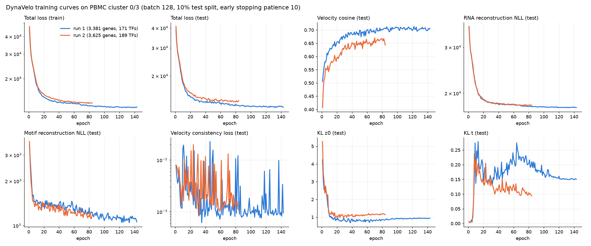
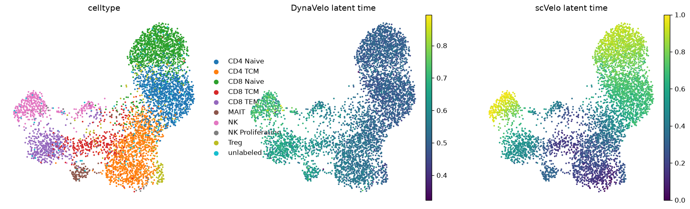
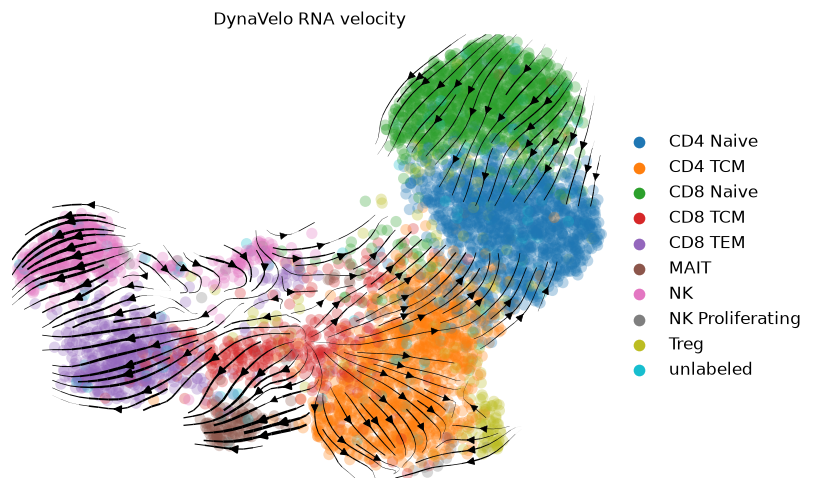

# DynaVelo の 2 回目の学習 — VCC 標的を遺伝子セットに入れる

2026-10-05 実施。1 回目（[`docs/11`](11-DynaVeloの実行結果.md)）のモデルは本番 300 標的のうち 85 個しか
扱えなかったので、標的を入れて学習し直した。目的は v25 に足す遺伝子特徴を作ること。

* **公開ページ**: <https://pphouse.github.io/virtual_cell/>
* **2 回目のビューワー**: <https://pphouse.github.io/virtual_cell/viewer_run2.html>
  （リポジトリ内では [`docs/dynavelo/viewer_run2.html`](dynavelo/viewer_run2.html)）
* **学習曲線**: [`docs/dynavelo/training/`](dynavelo/training/)
* **結果ファイル**: [`docs/dynavelo/results/`](dynavelo/results/) の `dynavelo_pbmc_v2_with_targets.pth`・
  `dynavelo_unit_response.npz`・`dynavelo_gene_features.npz`

---

## 0. 最初に読むべき 3 行

1. **標的 346 個（本番 300 + 2025 検証 46）はすべてモデルに入った。** ただし 192 個は
   「保護したから入った」だけで、本番 300 標的の発現細胞割合の中央値は 7%。
2. **モデルの質は 1 回目よりやや悪い。** テストの速度コサイン 0.711 → 0.666、MAIT では 0.855 → 0.432。
3. **そこから作った遺伝子特徴は効かなかった。** K562 の実測署名と相関せず、v25 に足すと
   H1 代理スコアは 4 シードすべてで悪化した（詳細は `docs/11` §7）。

---

## 1. 1 回目から変えたこと

変えたのは遺伝子セットだけ。細胞（5,225 個、CD4・CD8・NK・MAIT を含む全 T/NK）、
ハイパーパラメータ、分割の乱数シードは同じ。

`dynavelo/01_prep_rna.py` に `data/vcc_target_genes.txt`（346 遺伝子）を渡し、
`scv.pp.filter_and_normalize(min_shared_counts=10, retain_genes=...)` で
spliced/unspliced のフィルタから保護した。そのうえで HVG ∪ モチーフ TF ∪ 高発現 ∪ 標的を取る。

| | 1 回目 | 2 回目 |
|---|---|---|
| モデル遺伝子 | 3,381 | **3,625** |
| うちモチーフ TF | 170 | 179 |
| chromVAR に掛けたモチーフ → TF | 182 → 171 | 200 → **189** |
| scVelo の速度が推定できた遺伝子 | 392 | 399 |
| 本番 300 標的のカバー | 85 | **300** |

### 標的はどんな遺伝子か

本番 300 標的が 2 回目の遺伝子セットに入った理由:

| 理由 | 個数 |
|---|---|
| HVG | 53 |
| 高発現上位 2,000 | 57 |
| モチーフ TF | 13 |
| **どれでもなく、保護したから入った** | **192** |

PBMC の T/NK 細胞での発現細胞割合（300 標的）:

| 分位 | 10% | 25% | 50% | 75% | 90% |
|---|---|---|---|---|---|
| 発現細胞の割合 | 0.013 | 0.035 | 0.070 | 0.168 | 0.306 |

2% 未満が 48 個、5% 未満が 109 個、10% 超は 119 個。
**標的の 3 分の 1 は、このデータではほぼ発現していない。**
チャレンジが非必須遺伝子を選んでいること（`docs/09` §2.1）と、
context A が T 細胞ではなく細胞株であることの両方が効いている。

---

## 2. 学習

既定ハイパーパラメータ、バッチ 128、テスト 10%。Tesla T4 で **84 エポック・35 分**。



| | 1 回目 | 2 回目 |
|---|---|---|
| 停止エポック | 143 | 84 |
| 保存されたチェックポイント（テスト損失最小） | エポック 133 | エポック 74 |
| テスト損失の最小 | 12,644 | 13,762 |
| そのときの速度コサイン | 0.711 | 0.666 |
| 最終エポックの RNA 再構成 NLL | 17,646 | 18,000 |
| 最終エポックのモチーフ再構成 NLL | 1,059 | 1,179 |

* 総損失は遺伝子が 244 個多い分だけ大きく、2 回の間で絶対値は比べられない。
* **速度コサインは全エポックで 1 回目より低い**（同じエポック 74 で 1 回目は約 0.70）。
  早く止まったからではなく、最初から下を走っている。低発現の標的を足して
  再構成の負担が増えたことが原因として考えられるが、切り分けていない。
* KL(t) は 1 回目が 0.15 付近で落ち着くのに対し、2 回目は 0.09 まで下がり続けている。
  潜在時間の事後分布が事前分布 Beta(2,2) に寄っている＝時間の情報が弱い。

エポックごとの値は [`training_log_v2.csv`](dynavelo/training/training_log_v2.csv)。

---

## 3. 予測の質

`evaluation-sample`、20 サンプル。

| 指標 | 1 回目 | 2 回目 |
|---|---|---|
| 速度コサイン（全細胞平均） | 0.734 | 0.719 |
| 速度コサイン（中央値） | 0.753 | 0.754 |
| RNA 再構成（全要素の Pearson） | 0.560 | 0.560 |
| RNA 再構成（遺伝子平均どうし） | 0.996 | 0.993 |
| モチーフ再構成（全要素） | 0.726 | 0.751 |
| モチーフ再構成（TF ごとの中央値） | 0.436 | 0.427 |
| 潜在時間の Spearman（DynaVelo vs scVelo） | −0.456 | **−0.330** |
| 潜在時間の範囲 | 0.27〜0.87 | 0.32〜0.90 |

細胞種ごと（2 回目。括弧内は 1 回目）:

| 細胞種 | 細胞数 | DynaVelo 潜在時間 | 速度コサイン | context A 割り当て |
|---|---|---|---|---|
| CD4 Naive | 1,257 | 0.484 (0.475) | 0.672 (0.644) | 13,894 |
| CD8 Naive | 1,178 | 0.492 (0.481) | 0.735 (0.700) | 83 |
| Treg | 177 | 0.497 (0.504) | 0.635 (0.656) | 345 |
| unlabeled | 132 | 0.502 (0.467) | 0.663 (0.714) | 771 |
| CD4 TCM | 1,134 | 0.528 (0.532) | 0.720 (0.765) | 3,240 |
| CD8 TCM | 335 | 0.574 (0.620) | 0.795 (0.822) | 10 |
| MAIT | 113 | 0.613 (0.754) | **0.432 (0.855)** | 0 |
| NK Proliferating | 25 | 0.625 (0.656) | 0.787 (0.843) | 0 |
| CD8 TEM | 463 | 0.633 (0.649) | 0.878 (0.854) | 0 |
| NK | 411 | 0.671 (0.619) | 0.696 (0.813) | 0 |

* 潜在時間の順序（ナイーブ → TCM → エフェクター）は保たれている。
* **MAIT が崩れた。** 1 回目は潜在時間の終点（0.754）で速度の一致も最良だったのが、
  2 回目は中ほど（0.613）に落ち、速度コサインは 0.432。NK も 0.813 → 0.696。
* context A が乗る CD4 Naive は 0.644 → 0.672 とわずかに良いが、CD4 TCM は 0.765 → 0.720 と悪い。
* **同じデータ・同じ設定で遺伝子を 7% 足しただけで、細胞種の順位が入れ替わる。**
  学習された力学がどこまで安定かの目安になる。1 回しか学習していないので、
  乱数シードによる振れとの切り分けはできていない。

モチーフ速度の絶対値が大きい TF: ZEB1、JUN、BNC2、BATF、FOSL2、FOS、TCF4、BACH1、TCF12、TCF3、TBX21、BACH2。
AP-1 系が上昇、TCF 系（E-box）が低下という構図は 1 回目と同じ。




---

## 4. 単位摂動応答（`dynavelo/07_gene_features.py`）

1 回目の「最小値に置く」ノックダウンは、効果が摂動遺伝子の発現量に比例した（`docs/11` §3.3）。
発現細胞 7% の標的では入力がほとんど動かない。そこで標的ごとに**入力発現を一律 1 だけ下げ**、
context A 対応の 466 細胞で重み付け平均したデコード発現の変化を取った（有限差分のヤコビアン列）。

346 標的 × 3,625 遺伝子:

| | 値 |
|---|---|
| 応答ノルムの中央値（最小〜最大） | 0.022（0.003〜0.143） |
| 応答どうしの \|コサイン\| の平均 | 0.566 |
| 遺伝子方向に中心化した後の分散 | 第 1 成分 **0.759**、第 2 成分 0.182、第 3 成分 0.046、第 4 成分 0.011 |

* **第 1 成分**: IL32・CAMK4・リボソーム遺伝子・LTB・TRAC・LEF1 ↔ NKG7・AOAH・ZEB2・CD247・CTSW
  （T 細胞 ↔ 細胞傷害性/NK）
* **第 2 成分**: MAML2・LEF1・BACH2・FOXP1・BCL2 ↔ PFN1・ACTB・ACTG1・GAPDH・S100A4
  （ナイーブ ↔ 活性化/細胞骨格）

**4 成分で分散の 99.8%。** 中心化して共通応答を除いても、標的ごとの違いは
「2 本の細胞種軸のどちら向きにどれだけ」でほぼ尽きる。50 次元の特徴にしたが実質は数次元。

**応答が最も大きい標的は、T 細胞で発現しない遺伝子だった**: KRT18 0.143、CTSV 0.134、GLI3 0.100、
GNG12 0.099、ZNF628 0.098、MAPK12 0.093。入力が常に 0 の遺伝子を −1 に動かすのは学習範囲の外で、
エンコーダの重みが正則化されずに残った成分を拾っていると考えられる。
**特徴の大きな成分が外挿ノイズに支配されている可能性が高い。**

---

## 5. 遺伝子特徴としての検証

`docs/11` §7.2〜§7.3 に全表がある。要点:

* **K562 の実測署名（本番標的 267 個）との比較**: DynaVelo 特徴の近傍 5 個の実測類似度は −0.0041 で、
  ランダム（−0.0032）と区別がつかない。v25 の類似度（+0.0021）に足すと下がる。
* **H1 代理スコア**: 類似度のシェア 10% で足して、4 シードとも v25 を下回った（平均 −0.0072）。
* 提出には使っていない。同日に出した提出（Overall +0.0720）は DynaVelo なしの v25 構成。

---

## 6. in-silico ノックダウン（全 3,625 遺伝子）

1 回目と同じ集計（`dynavelo/04_perturb_contextA.py`）を 2 回目のモデルでも実行した。
**このレポートを書いた時点では実行中**で、終わり次第ビューワーの「3. in-silico ノックダウン」と
「TF ノックダウンによる潜在時間の変化」に反映し、この節に数値を追記する。

---

## 7. なぜ効かないか — 2 回やって分かったこと

1. **標的が発現していない。** 3 分の 1 は 5% 未満。発現しない遺伝子について、
   非摂動データから学んだモデルが言えることは無い。
2. **学習データの多様体が低次元。** T/NK 細胞の違いは 2〜4 本の軸でほぼ説明でき、
   どの入力を動かしてもその軸の上を動くだけになる。摂動ごとの違いを識別する `pds` には使えない。
3. **細胞種が合っていない。** 学習は CD8・NK・MAIT を含む全 T/NK で、損失の重みは頻度の逆数なので
   少数の無関係な集団ほど重い。context A の 99% は CD4 系と unlabeled に対応する。
   CD4 系だけで学習し直す案はあるが、多様性がさらに減り、速度の信号も弱くなる（未実施）。
4. **context A との対応が弱い。** 細胞株を 2 次元 UMAP の最近傍で初代 T 細胞に結んでいる。
   対応の妥当性そのものを検証していない。
5. **モデルが安定でない。** 遺伝子を 7% 足すだけで MAIT の速度コサインが半分になる。

DynaVelo の用途は軌道上の TF の順位付けで、摂動後の発現プロファイルの定量予測ではない。
この用途の違いが、上の 1〜2 としてそのまま出ている。

---

## 8. 再現

```bash
# 標的リスト（本番 300 + 2025 検証 46）を置く
(cat vcc_sp/targets300.txt; cut -d, -f1 vcc_sp/vcc2025/pert_counts_Validation.csv | tail -n +2 | grep -v non-targeting) \
  | sort -u > data/vcc_target_genes.txt

.venv/bin/python dynavelo/01_prep_rna.py            # 3,625 遺伝子
.venv/bin/python dynavelo/02_prep_atac_chromvar.py  # 189 TF。メモリ 16 GB を使うので単独で回す
.venv/bin/python dynavelo/03_train_dynavelo.py 200  # 35 分
.venv/bin/python dynavelo/07_gene_features.py 50 1  # 単位摂動応答 → 50 次元（第 1 成分を除く）
virtual_cell/.venv/bin/python dynavelo/08_blend_and_validate.py 0.5 1.0   # 実測署名との比較とブレンド
.venv/bin/python dynavelo/05_qc.py
.venv/bin/python dynavelo/04_perturb_contextA.py    # 約 95 分
.venv/bin/python dynavelo/06_build_viewer.py dynavelo/viewer_template.html \
    docs/dynavelo/viewer_run2.html dynavelo/viewer_extra_run2.json
```

**chromVAR と DE 真値計算（`local_reference_de.py`）を同時に走らせると 27 GB でも OOM する。**
実際に両方が OOM killer に落とされた。
